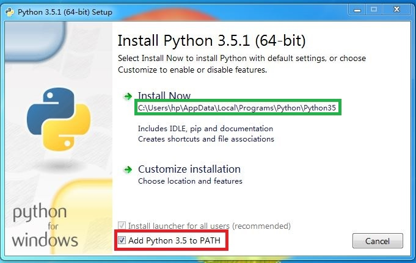

# 使用说明

* 下载并安装 [python3](https://www.python.org/ftp/python/3.5.1/python-3.5.1.exe)，务必勾选`Add Python to PATH`选项，如图红色方框所示
* 首次使用前，双击conf.bat脚本配置运行环境
* 双击app.py文件，启动程序
* 关闭运行的小黑窗，退出程序

# 拆卸说明

1. 控制面板 -> 拆卸程序 -> Python
2. 删除python安装路径，默认安装路径请参考图中绿色方框处，`AppData`文件夹是隐藏文件夹，可以在文件浏览器顶部直接输入路径名进入该文件夹
3. 删除本程序所在文件夹

